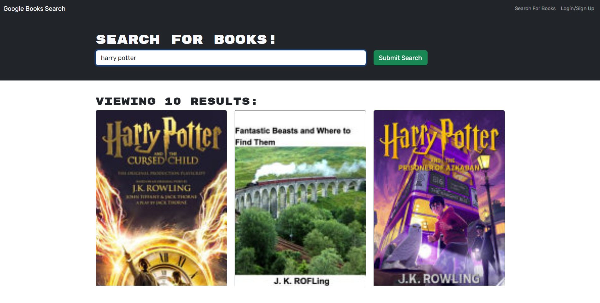

# Book-Search-Engine
## Overview

This project involves refactoring a fully functioning Google Books API search engine from a RESTful API to a GraphQL API. It was originally built on a RESTful API, part of the MERN stack, utilizing React for the front end, MongoDB as the database, and Node.js/Express.js for the server and API. The application was refactored into a GraphQP API using an Apollo server in order to enhance performance.
- Apollo Server Setup: Refactored to use GraphQL queries and mutations, replacing the existing RESTful API
- Authentication Middleware Modification: Adapted authentication middleware for the GraphQL API
- Apollo Provider Creation: Established an Apollo Provider to facilitate communication with the Apollo Server

## Book Search Engine Visualization

## Deployment
See it live at: https://enigmatic-wave-12331-e95c0d7aeb38.herokuapp.com/

